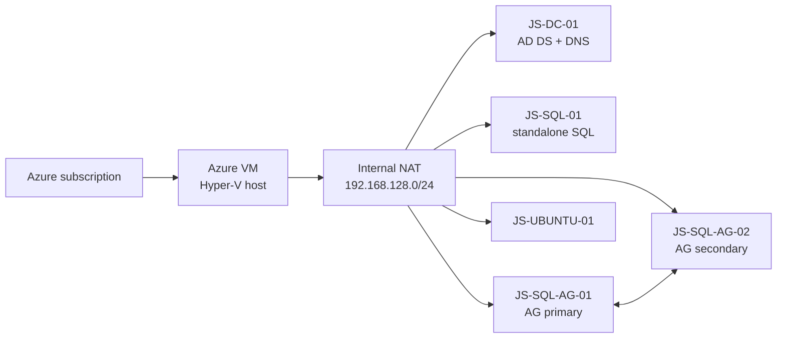

# Arc Jumpstart v2

**Clone this repo and ask your agent: "Help me use this to make an Arc environment."**

The agent should read [`AGENTS.md`](AGENTS.md), collect only the missing Azure,
cost, and credential decisions, then build and verify the lab without making
the learner perform infrastructure setup.

## Optional guided skill

For a more consistent agent workflow, preview and install the repository's
`arc-jumpstart` skill with GitHub CLI 2.90.0 or later:

```text
gh skill preview markgar/arc-jumpstart arc-jumpstart
gh skill install markgar/arc-jumpstart arc-jumpstart --agent github-copilot --scope user
```

`gh skill` is in public preview. Preview skills before installing them. Start a
new Copilot session or run `/skills reload`, then ask:

```text
Use /arc-jumpstart to help me build this lab.
```

The skill is optional. The repository scripts and runbooks remain the source of
truth.

## What this builds

The lab creates an Azure-hosted Windows Server 2022 Hyper-V environment that
an agent prepares for:

1. User-authenticated Azure Arc onboarding.
2. Azure Migrate assessment and Resource Graph inventory modeling.
3. A simple migration of one database to Azure SQL Managed Instance.



The agent prepares the domain, three SQL Server 2025 Enterprise Developer
instances, sample databases, WSFC, availability group, listener, Arc resource
group, and desktop launchers. The user then opens the launcher and authenticates
with their own Azure identity. The workshop starts after Arc inventory is ready:
perform or reuse an assessment, export modeling data, and migrate
`JumpstartStandaloneDB` to a small SQL managed instance.

This is a disposable evaluation environment. The default outer host is
`Standard_E16s_v7` in `westus2`, with a 1 TiB Premium SSD and optional Azure
Bastion. Review current Azure pricing, quota, licensing, and auto-shutdown
before deployment.

## Prerequisites

- An Azure subscription and interactive Azure CLI user with the permissions in
  [`docs/01-prerequisites.md`](docs/01-prerequisites.md).
- macOS, Linux, or WSL2 on Windows.
- Azure CLI with Bicep, Python 3, Git, and normal POSIX tools.
- A private configuration file outside the repository.

Native Windows and Git Bash may run source validation, but full deployment and
lab management require WSL2. See the
[Windows setup and no-WSL options](docs/01-prerequisites.md#windows-required-wsl2-setup).

## Configure and build

Create the private environment file in durable owner-only storage. This example
works on macOS, Linux, and inside WSL2:

```bash
ENV_FILE="$HOME/.config/arc-jumpstart/lab.env"
mkdir -p "$(dirname "$ENV_FILE")"
if [[ ! -f "$ENV_FILE" ]]; then
  install -m 600 deploy.env.example "$ENV_FILE"
fi
${EDITOR:-vi} "$ENV_FILE"
```

Replace every `CHANGEME`. The file name is not important; `ENV_FILE` is the
exact path used by every command.

| Credential | Setting |
|---|---|
| Azure host/Bastion | `HOST_ADMIN_USERNAME`, `HOST_ADMIN_PASSWORD` |
| Nested Windows local Administrator and `JUMPSTART\Administrator` | `NESTED_WINDOWS_PASSWORD` |
| Directory Services Restore Mode | `SAFE_MODE_PASSWORD` |
| SQL domain service account | `SQL_SERVICE_ACCOUNT_PASSWORD` |

Passwords are not printed after creation. Record the private `ENV_FILE` path;
do not commit the file or recover secrets from deployment logs.

Run:

```bash
az login
./scripts/validate.sh &&
ENV_FILE="$ENV_FILE" ./scripts/preflight.sh infra &&
ENV_FILE="$ENV_FILE" ./scripts/deploy.sh all
```

Keep deployment running in its own terminal. Request one status snapshot when
needed:

```bash
ENV_FILE="$ENV_FILE" ./scripts/lab.sh build-status
```

Do not start a second deployment because the first terminal is quiet. For
recovery, rerun only the failed stage and required successors—never rerun
`all` against an already promoted domain.

## Use the lab

- [Deployment, access, and SSMS](docs/02-deploy.md)
- [Complete user-authenticated Arc setup](docs/03-arc-onboarding.md)
- [Azure Migrate assessment](docs/04-assessment.md)
- [Migrate one database to SQL Managed Instance](docs/05-migration.md)
- [Troubleshooting, shutdown, and cleanup](docs/06-troubleshooting-cleanup.md)

Agent and implementation references:

- [Agent bootstrap and readiness contract](docs/00-agent-bootstrap.md)
- [Infrastructure stages](infra/README.md)
- [Script commands](scripts/README.md)
- [Domain-controller runbook](docs/02-domain-controller.md)
- [SQL AG lessons and recovery boundaries](docs/02-sql-ag-lessons.md)
- [Clean-room evidence and remaining gaps](docs/02-clean-room-lessons.md)

The default VHDX files are external Microsoft Jumpstart artifacts and are not
redistributed here. Stage `40` generalizes the Windows parent before cloning;
stage `45` installs SQL from verified Microsoft media. See the prerequisites
and troubleshooting guide before changing images, media, or licensing.
