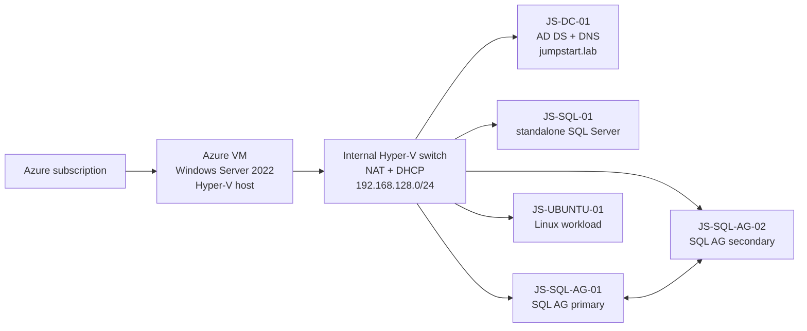

# Arc Jumpstart v2

Arc Jumpstart v2 builds a realistic, disposable Hyper-V environment in Azure for learning three separate activities:

1. Manually onboard Windows, Linux, and SQL Server machines to Azure Arc.
2. Assess the Arc-enabled estate with Azure Migrate's Arc-based discovery.
3. Replicate, test, and migrate a Hyper-V guest to Azure.

**Infrastructure is automated preparation, not the exercise.** An agent should
be able to use this repo and supplied configuration to deliver the ready lab
without rediscovering setup fixes from a previous conversation. Start at
[AGENTS.md](AGENTS.md) and the [agent bootstrap runbook](docs/00-agent-bootstrap.md).
The implementation maps are in [infra/README.md](infra/README.md) and
[scripts/README.md](scripts/README.md).

This repository is a new Bicep-first implementation. It is not a fork of
[`microsoft/azure_arc`](https://github.com/microsoft/azure_arc) and does not copy its ARM templates or orchestration code. It currently consumes Microsoft's public Jumpstart VHDX artifacts as an external image source.

This topology is for **evaluation and training only**. The simulated on-premises Hyper-V host itself runs in Azure; validate Arc agent Azure-environment detection and Hyper-V differencing-disk replication before relying on the complete learner journey.

> [!IMPORTANT]
> Azure Migrate Arc-based discovery is in preview. It currently includes Arc-enabled servers running as VMware or Hyper-V VMs and requires Connected Machine agent version 1.46 or later. Review the current [Arc-based discovery documentation](https://learn.microsoft.com/azure/migrate/concepts-arc-resource-discovery) before using the lab.

## What gets built



All four Windows guests use differencing disks from one locally generalized Windows parent. SQL Server 2025 Enterprise Developer is installed after cloning, using installation media downloaded once on the host. No preconfigured SQL VHDX is cloned.

Stage `40` verifies completed Windows first-boot setup, Azure KMS activation and a unique Windows machine SID for every clone. It stops before domain creation if the externally maintained images no longer meet these requirements.

## Numbered stages

| Stage | Purpose | Safe to rerun |
|---|---|---|
| `00` | Resource group foundation, VNet, NSG, and reserved access subnet | Yes |
| `10` | Hyper-V host VM, data disk, Hyper-V and DHCP roles | Yes |
| `20` | Internal switch, NAT and DHCP scope | Yes |
| `30` | Download the Windows and Ubuntu VHDX base images | Yes; existing files are skipped |
| `40` | Create and rename five nested guests from differencing disks | Before domain promotion, with matching parent revision; conflicting disks are retained |
| `45` | Install SQL Server Developer and SQL command-line tools on the three SQL guests | Yes; healthy installations are verified and retained |
| `50` | Create `jumpstart.lab`, service account, and domain-join SQL servers | Yes |
| `60` | Build WSFC, file-share witness, sample database, AOAG and listener | Yes |

Stages `00`-`60` prepare the lab. Azure Arc onboarding, assessment, and migration are deliberately guided exercises rather than automated scripts.

Bastion is enabled by default, but deployed separately with no build dependency.
After stage `00`, the wrapper submits Bastion without waiting, then runs stages
`10`-`60`. Nothing in the build waits for Bastion, including final completion.
Azure finishes Bastion independently; the build does not monitor it.
Set `DEPLOY_BASTION=false` only if you want to omit it.

Daily auto-shutdown is supported but has no silent default. Before a new build,
choose `AUTO_SHUTDOWN_ENABLED=true` or `false`; when enabled, also choose the
daily `HHmm` time and Windows time-zone ID. The example suggests 10:00 PM
Central, but the operator must explicitly approve the schedule because it can
interrupt active lab or migration work.

New builds also stage a clickable **Connect to Azure Arc** launcher on every
Windows guest's public desktop. This avoids relying on clipboard integration
through the Bastion and nested Hyper-V console boundary. Staging is inert: it
does not install the agent, start device authentication or connect a machine
until the learner opens it. Set `PREPARE_ARC_LAUNCHERS=false` to omit the
launchers. Unless overridden, the dedicated Arc resource group is named by
appending `-arc` to the infrastructure resource group and uses the same region.

## Quick start

### Let an attached agent run it

Open this repository in an agent-enabled workspace and give the agent this
instruction:

> Follow `AGENTS.md` and build a new lab. Use my approved Azure target and
> credentials, run validation and preflight first, then start
> `./scripts/deploy.sh all` in a separate visible terminal so you remain
> responsive. Do not poll continuously. When I ask for progress, run one
> `./scripts/lab.sh build-status` check. Stop after stage `60`; do not onboard
> Arc or start assessment or migration.

The agent should ask only for genuinely missing Azure target, authentication,
credential or cost-scope inputs. The long deployment runs in its own terminal;
the conversation remains available for questions and one-shot status checks.

### Run it yourself

Keep credentials outside the repository. On macOS, one convenient location is
shown below; any approved owner-only absolute path works:

```bash
ENV_FILE="$HOME/.config/arc-jumpstart/lab.env"
mkdir -p "$(dirname "$ENV_FILE")"
if [[ ! -f "$ENV_FILE" ]]; then
  install -m 600 deploy.env.example "$ENV_FILE"
fi
# Edit $ENV_FILE and replace every CHANGEME value.

az login
./scripts/validate.sh &&
ENV_FILE="$ENV_FILE" ./scripts/preflight.sh infra &&
ENV_FILE="$ENV_FILE" ./scripts/deploy.sh all
```

Keep that terminal open. In another terminal, request a one-shot progress view
without starting another operation:

```bash
./scripts/lab.sh build-status
```

For a new lab, `all` is the normal path. Numbered stages are agent debugging and
recovery checkpoints, not manual learner assignments. Resume only the affected
stage and its successors; do not rerun `all` against a promoted domain simply
to retry a later failure.

The build overlaps independent work: Bastion runs beside the host pipeline;
image downloads run while the nested network is configured; all nested guests
start before per-guest Windows readiness checks; and SQL installs run on the
three guests in parallel. Stage `40` still requires both networking and images
to succeed, and domain/cluster readiness gates remain mandatory.
Use `ENV_FILE=/absolute/private/path/lab.env ./scripts/lab.sh status`, `stop`,
and `start` for lifecycle operations. Use the same private file for deployment,
status, and recovery.

During a long-running stage, `./scripts/lab.sh build-status` discovers all active
canonical stages and reads their existing Managed Run Command state, elapsed
time and bounded latest timestamped output without launching another VM
command. Use `stage-progress <stage>` when the stage is already known. Detailed
logs remain on the workshop host; no storage account or public log endpoint is
created. Use `stage-log` for a longer diagnostic tail after the stage is
terminal.

The development lab and a separate fresh Windows-template proof succeeded.
A clean replay of the complete updated pipeline, including parallel SQL
installation, remains the repeatability acceptance gate; see the
[recorded evidence and limits](docs/02-sql-ag-lessons.md#what-this-does-not-prove-yet).

Stage `30` downloads about 38 GiB directly on the host. Stage `45` separately downloads SQL installation media once and installs the three instances in parallel, with one worker per guest. Both wrappers wait until their managed Run Command finishes; Azure does not send a separate completion notification. Allow additional time for the SQL installations rather than treating VM creation as SQL readiness.

Continue with:

- [Agent bootstrap and ready-environment contract](docs/00-agent-bootstrap.md)
- [First clean-room attempt: findings and remaining gaps](docs/02-clean-room-lessons.md)
- [Prerequisites and cost considerations](docs/01-prerequisites.md)
- [Deploy and inspect the lab](docs/02-deploy.md)
- [Understand and troubleshoot the automated domain controller](docs/02-domain-controller.md)
- [Read the SQL AG build sequence, lessons learned and recovery boundaries](docs/02-sql-ag-lessons.md)
- [Manually onboard the guests to Azure Arc](docs/03-arc-onboarding.md)
- [Run an Arc-based Azure Migrate assessment](docs/04-assessment.md)
- [Test and perform a Hyper-V migration](docs/05-migration.md)
- [Troubleshooting and cleanup](docs/06-troubleshooting-cleanup.md)

## Image dependency

Stage `30` defaults to these public artifacts:

- `ArcBox-Win2K22.vhdx`
- `ArcBox-Ubuntu-01.vhdx`

They are downloaded from `https://jumpstartprodsg.blob.core.windows.net/arcbox/prod` and are not redistributed by this repository. The files are approximately 38 GiB in total and can change or disappear independently of this project. For a durable environment, copy approved images into your own private container and override `imageSourceUrl` in stage `30`.

The image URL and both file names can also be changed in `deploy.env`. For private containers, provide a read-only container SAS through `IMAGE_SOURCE_SAS_TOKEN`. Stage `40` generalizes a Windows-only parent; SQL must not be preinstalled in it. Stage `45` uses `SQL_DOWNLOAD_URL` for Microsoft's SQL Server 2025 Enterprise Developer media and installs SQL after the new Windows SIDs are established. Enterprise Developer is for non-production use only; running stage `45` accepts the Microsoft installer license terms. Standard Developer and time-limited Evaluation are not substitutes for this lab's edition.

If updating a disposable lab from the earlier SQL-image design, replace `SQL_IMAGE_FILE_NAME` in `deploy.env` with `SQL_DOWNLOAD_URL` from the example file. Stage `40` rejects SQL guests whose disks still use the old SQL parent; it does not delete them automatically. Preserve needed data and explicitly plan a fresh lab or scoped rebuild. Likewise, old generalized-parent readiness markers require deliberate recovery, not an in-place parent rewrite. Do not rebuild an already onboarded or replicated lab without completing its cleanup.

## Security and migration compatibility choices

The host explicitly uses Azure VM security type **Standard** so the lab does not depend on subscription-level Trusted Launch defaults or changing feature compatibility. The nested guests use Generation 2 virtual hardware, but Secure Boot is disabled because Azure Migrate's Hyper-V replication path does not support migrating Secure Boot guests.
