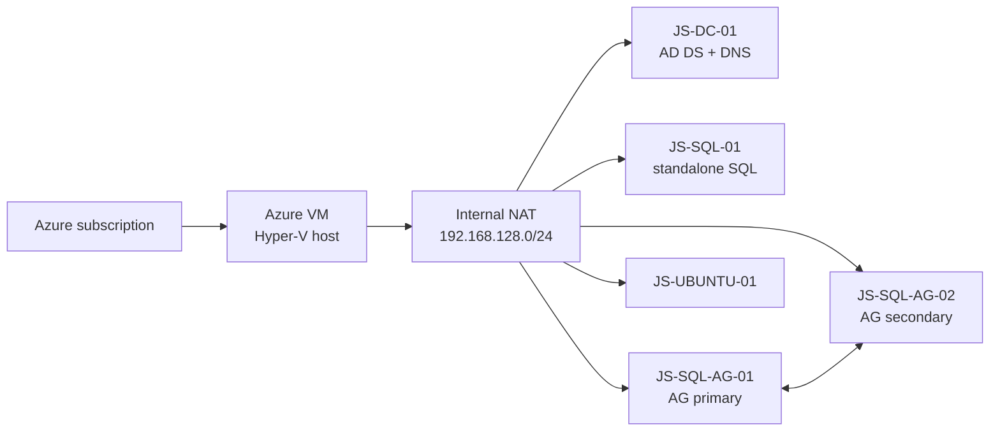

# Arc Jumpstart v2

**Clone this repo and ask your agent: "Help me use this to make an Arc environment."**

After collecting the required Azure target, cost, and credential decisions,
your agent should create and verify the complete environment without further
intervention. It should run through the domain, SQL installations, cluster,
availability group, sample databases, and Arc launcher staging.

The agent stops before adding the servers to Azure Arc because that step
requires you to authenticate with your own Azure identity. Open the staged
launcher on each server and complete the device-code sign-in. The Arc-enabled
SQL Server extension should then deploy automatically and inventory the SQL
instances and databases. When the Arc machine and SQL resources are healthy,
the environment is ready for the assessment, modeling, and migration workshop
exercises.

## Optional guided skill

For a more consistent agent workflow, preview and install the repository's
`arc-jumpstart` skill with GitHub CLI 2.90.0 or later:

```text
gh skill preview markgar/arc-jumpstart arc-jumpstart
gh skill install markgar/arc-jumpstart arc-jumpstart --agent github-copilot --scope user
```

`gh skill` is in public preview. Preview skills before installing them. Start a
new Copilot session or run `/skills reload`, then ask:

```text
Use /arc-jumpstart to help me build this lab.
```

The skill is optional. The repository scripts and runbooks remain the source of
truth.

## What this builds

The lab creates an Azure-hosted Windows Server 2022 Hyper-V environment that
an agent prepares for:

1. User-authenticated Azure Arc onboarding.
2. Azure Migrate assessment and Resource Graph inventory modeling.
3. A simple migration of one database to Azure SQL Managed Instance.



The agent prepares the domain, three SQL Server 2025 Enterprise Developer
instances, sample databases, WSFC, availability group, listener, Arc resource
group, host-only SSMS 22 and desktop launchers. SSMS installation runs
independently after the numbered stages by default; on an existing host, use
`./scripts/deploy.ps1 ssms` to install or verify it without replaying `all`.
The user then opens the launcher and authenticates
with their own Azure identity. The workshop starts after Arc inventory is ready:
perform or reuse an assessment, export modeling data, and migrate
`JumpstartStandaloneDB` to a small SQL managed instance.

This is a disposable evaluation environment. The default outer host is
`Standard_E16s_v7` in `westus2`, with a 1 TiB Premium SSD and optional Azure
Bastion. Review current Azure pricing, quota, licensing, and auto-shutdown
before deployment.

## Prerequisites

- An Azure subscription and interactive Azure CLI user with the permissions in
  [`docs/01-prerequisites.md`](docs/01-prerequisites.md).
- PowerShell 7 and Azure CLI (including `az bicep install`) on Windows, macOS,
  or Linux. WSL2 is not required.
- A private configuration file outside the repository.

Run the PowerShell entry points from this checkout on Windows, macOS or Linux.
See the [workstation prerequisites](docs/01-prerequisites.md#workstation).

## Configure and build

From a PowerShell 7 terminal in the repository root, create a private
configuration template in the visible `ArcJumpstart` folder in your home
directory, outside the repository:

```powershell
./scripts/init-config.ps1
```

The command prints the absolute path without showing its contents and never
overwrites an existing file. Edit that file to replace every `CHANGEME`.
Set `$env:ENV_FILE` to its absolute path before running the remaining commands;
the same path must be used for all of them.

| Credential | Setting |
|---|---|
| Azure host/Bastion | `HOST_ADMIN_USERNAME`, `HOST_ADMIN_PASSWORD` |
| Nested Windows local Administrator and `JUMPSTART\Administrator` | `NESTED_WINDOWS_PASSWORD` |
| Directory Services Restore Mode | `SAFE_MODE_PASSWORD` |
| SQL domain service account | `SQL_SERVICE_ACCOUNT_PASSWORD` |

Passwords are not printed after creation. Record the private `ENV_FILE` path;
do not commit the file or recover secrets from deployment logs.

Run:

```powershell
$env:ENV_FILE = Join-Path $HOME 'ArcJumpstart/lab.env'
az login
./scripts/validate.ps1
./scripts/preflight.ps1 infra
./scripts/deploy.ps1 all
```

Only start each command after the preceding one succeeds. Keep deployment
running in its own terminal; request one status snapshot when needed:

```powershell
./scripts/lab.ps1 build-status
```

Do not start a second deployment because the first terminal is quiet. For
recovery, rerun only the failed stage and required successors—never rerun
`all` against an already promoted domain.

## Use the lab

### Find your lab configuration and passwords

Your `lab.env` file contains the lab configuration and passwords. For new labs,
use the visible `ArcJumpstart` folder, not a hidden folder. At the end of setup,
the agent must explicitly give you the **actual full path**, plus instructions
for finding and opening your file. Do not share or commit its contents.

| Platform | Usual full path (replace the example username) | Find and view the file |
|---|---|---|
| macOS | `/Users/alex/ArcJumpstart/lab.env` | In Finder, choose **Go > Home**, then open **ArcJumpstart**. Right-click `lab.env` and choose **Open With > TextEdit** to view it. |
| Windows native PowerShell | `C:\Users\alex\ArcJumpstart\lab.env` | Paste `C:\Users\alex\ArcJumpstart` into File Explorer's address bar, then open `lab.env` with Notepad. Use the actual path printed by `init-config.ps1`. |
| Windows with WSL2 | `/home/alex/ArcJumpstart/lab.env` inside WSL; `\\wsl.localhost\Ubuntu\home\alex\ArcJumpstart\lab.env` in Windows for an Ubuntu distro | Paste the folder path `\\wsl.localhost\Ubuntu\home\alex\ArcJumpstart` into File Explorer's address bar and press Enter. Right-click `lab.env` and open it with Notepad to view it. Use the actual distro and username supplied by the agent. |
| Linux | `/home/alex/ArcJumpstart/lab.env` | Open **Home > ArcJumpstart** in your file manager and open `lab.env` in a text editor. |

These are examples, not a way to locate an existing lab automatically. If you
already use a different `ENV_FILE`, keep using that exact file; do not overwrite
or silently move it. The agent must report its actual location instead. On
macOS, **Finder > Go > Go to Folder** also accepts the full containing folder
path. For native Windows PowerShell, `init-config.ps1` restricts the folder and
file to your account; for WSL, edit the file inside WSL and retain mode `600`.
If deployment runs on a remote execution host, the file is on that host, not
necessarily your laptop; the handoff must identify the host and how to access it.

### Learner guides

- [Deployment, access, and SSMS](docs/02-deploy.md)
- [Complete user-authenticated Arc setup](docs/03-arc-onboarding.md)
- [Azure Migrate assessment](docs/04-assessment.md)
- [Migrate one database to SQL Managed Instance](docs/05-migration.md)
- [Troubleshooting, shutdown, and cleanup](docs/06-troubleshooting-cleanup.md)

Agent and implementation references:

- [Agent bootstrap and readiness contract](docs/00-agent-bootstrap.md)
- [Infrastructure stages](infra/README.md)
- [Script commands](scripts/README.md)
- [Domain-controller runbook](docs/02-domain-controller.md)
- [SQL AG lessons and recovery boundaries](docs/02-sql-ag-lessons.md)
- [Clean-room evidence and remaining gaps](docs/02-clean-room-lessons.md)

The default VHDX files are external Microsoft Jumpstart artifacts and are not
redistributed here. Stage `40` generalizes the Windows parent before cloning;
stage `45` installs SQL from verified Microsoft media. See the prerequisites
and troubleshooting guide before changing images, media, or licensing.
